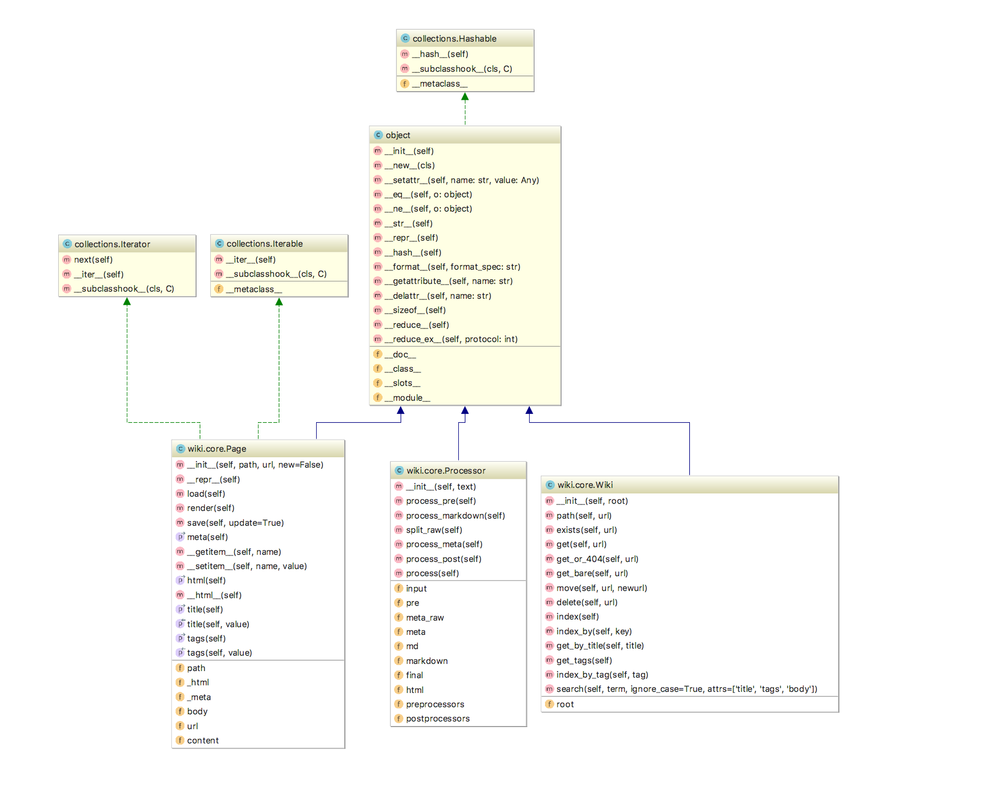

# UML class diagrams

* James Bond (leader), Freddie Mercury, Samuel Cho
* Date: 11/15/2017

## Wiki.core.Wiki 

* Written by Jame Bond

### Analysis 

This class encapsulates the wiki system's handling of directories, paths, indexing, and tagging. It is initialized with a variable root which defines the root path for the system, to be appended by the url of any given page or directory through the path() method. 

## Wiki.core.Processor 

* Written by Freddie Mercury

### Analysis

This class handles the processing ...