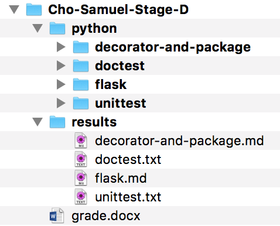

---
header-includes:
  - \hypersetup{colorlinks=true,
            allbordercolors={0 0 0},
            pdfborderstyle={/S/U/W 1}}
---

# CSC440/540 Project Stage D document

* Posted on Feb 13, 2018 (Tu)
* Deadline: same as the Stage C deadline
    *  You should submit your homework assignment before the deadline. No extension is allowed for Project D as the deadline is the same as the Stage C deadline.
* 40 points in total
* If you have any questions about this assignment, please send me an email or open a Discussion on Canvas. 
* (*) means revised from the previous version.

## Rules for submission and grading

### Submission rules

* Copy the `Last-First-Stage-D` directory and replace the directory name with your name, for example, `Cho-Samuel-Stage-D` In the directory, you should include only the homework related files you make or modify. Be careful not to include any hidden files.
* You should use a markdown file format for your homework assignments, and you should generate pdf file from the markdown using pandoc.
* Add both markdown source file and generated the pdf file. 
* Always use the directory `Last-First-Stage-D` when you submit your deliverables, not the `Stage D`. Zip the directory and upload the zip file on Canvas. Only the zip file format is allowed.

### Grading rules

Use the grade.docx for your grading or delegation of your grading. 
Be sure to check the options correctly.

## Assignments

Your directory should have the files as is shown in the screen capture. 



### Python unittest (10 points)

You need to fill in the blanks to pass all 29 (7+7+2+5+1+4+3) unittests.
As a proof you pass all the tests, copy the output when you run `run.sh` in the unittest.txt. 

```
smcho@NKU unittest> sh run.sh 
.......
----------------------------------------------------------------------
Ran 7 tests in 0.000s

<<Lots of tests output>>

OK
...
----------------------------------------------------------------------
Ran 3 tests in 0.159s

OK
```

### Python doctest (10 points)

You need to fill in the blanks to pass all doctests.
As a proof you pass all the tests, copy the output when you run `run1.sh` in the unittest.txt. You should get **nothing** when you run `run2.sh`.

```
smcho@NKU17R7044 doctest> sh run1.sh 
Trying:
    factorial(5)
Expecting:
    120
ok
<<Lots of tests output>>
1 items had no tests:
    sorting
3 items passed all tests:
   1 tests in sorting.bubblesort
   1 tests in sorting.insertionsort
   1 tests in sorting.quicksort
3 tests in 4 items.
3 passed and 0 failed.
Test passed.
```

### Python Flask/Jinja2 study (10 points)

Read the ppt and execute all the python/jinja2 examples accompanied. 
Make useful notes for yourself for a team project and exams including what you learned in each example. I don't specify the length, but it should be with reasonable contents and length to be useful for your preparation. If the instructor thinks the content is too low quality, then he can give 0 to 5 points. 

### Python Decorator and package study (10 points)

Read the ppt and execute all the decorator/package examples accompanied. 
Make useful notes for yourself for a team project and exams including what you learned in each example. I don't specify the length, but it should be with reasonable contents and length to be useful for your preparation. If the instructor thinks the content is too low quality, then he can give 0 to 5 points. 